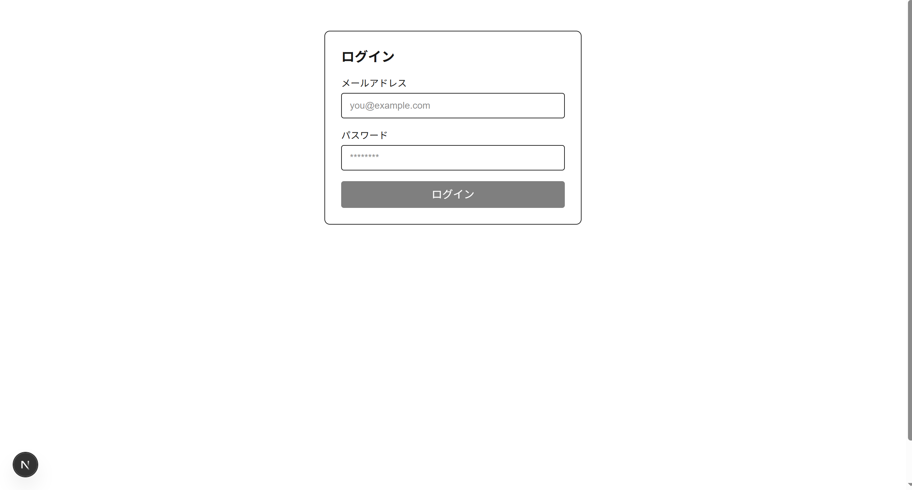
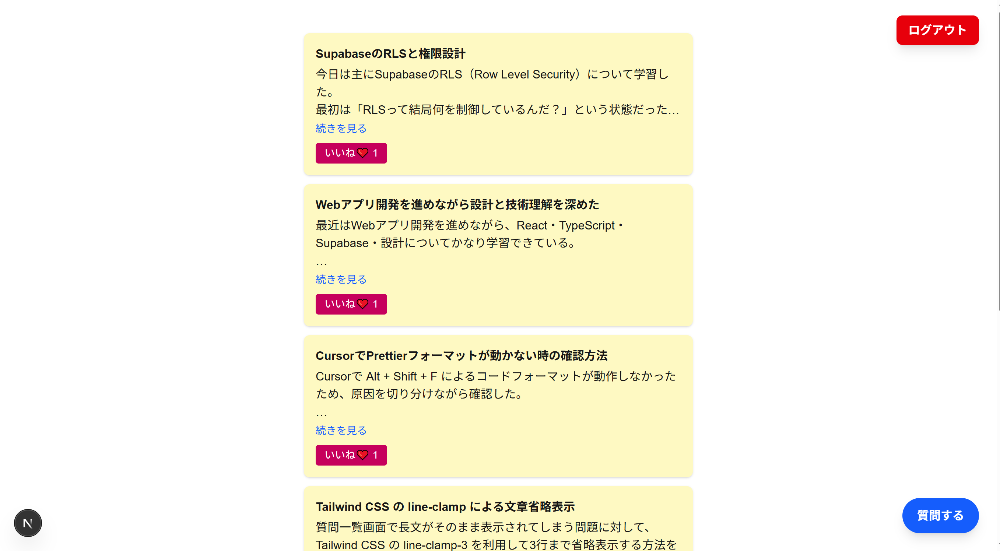
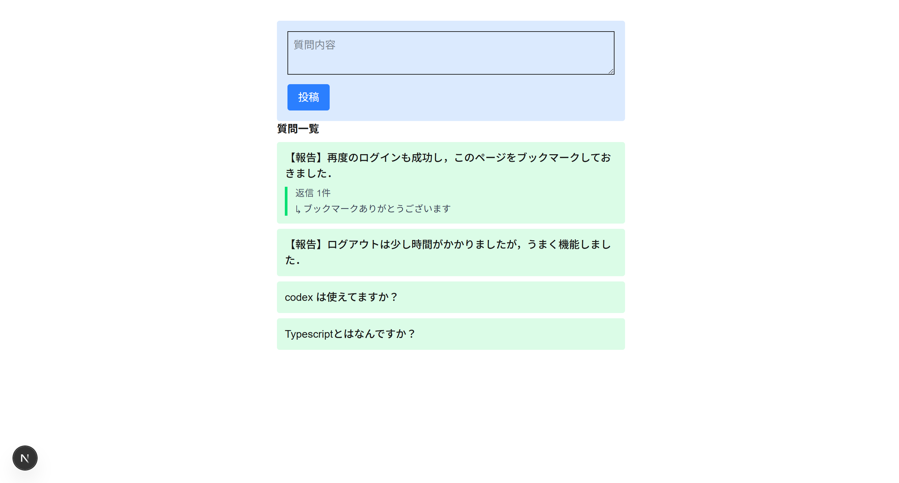
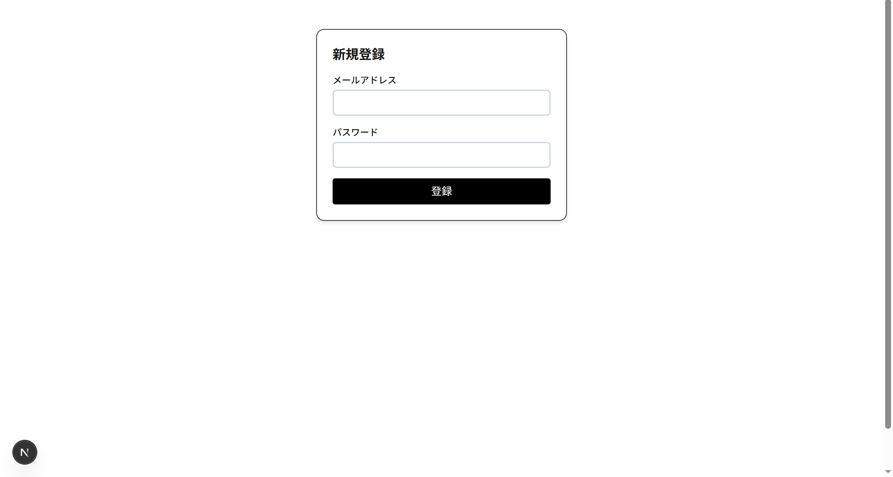
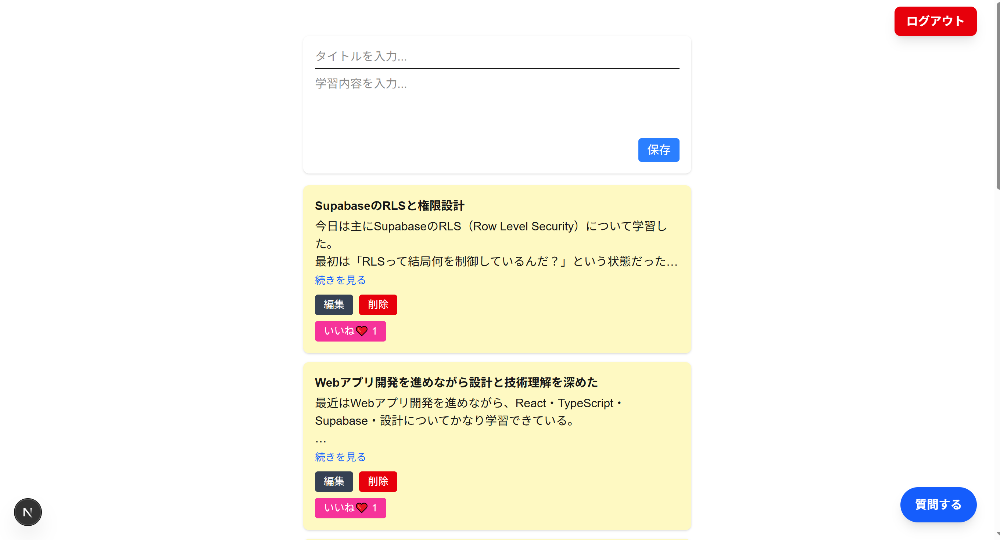
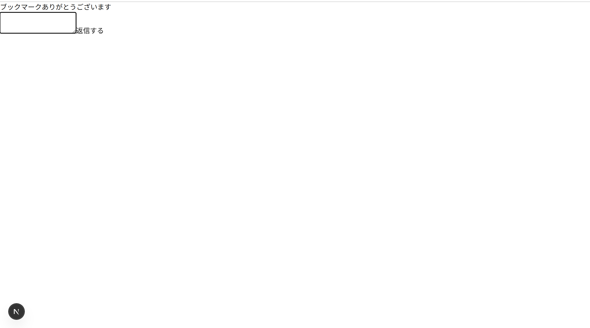
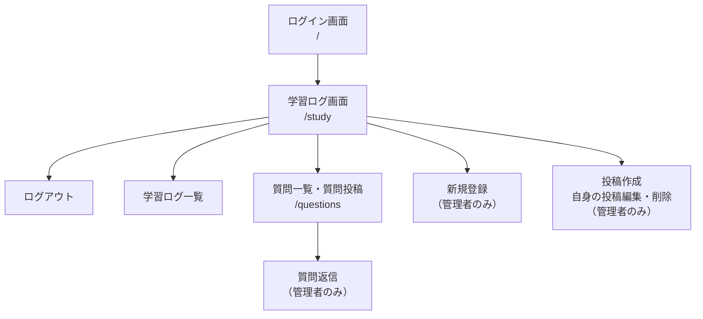
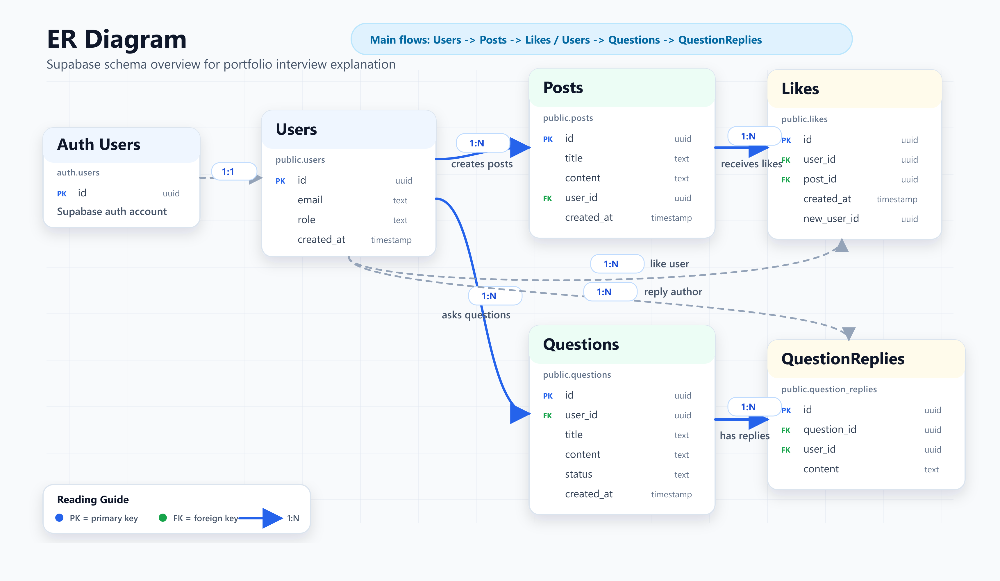
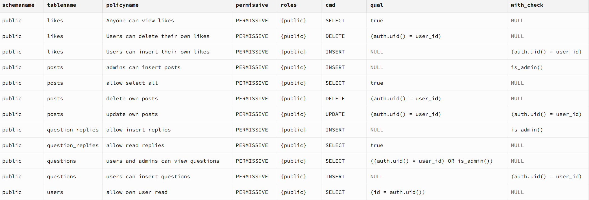

# 学習記録アプリ

## 目次

- [サービス概要](#サービス概要)
- [URL](#url)
- [ターゲット](#ターゲット)
- [画面一覧](#画面一覧)
- [画面遷移図](#画面遷移図)
- [使用技術](#使用技術)
- [ER図](#er図)
- [認証・認可設計](#認証認可設計)
- [RLS（Row Level Security）設計](#rls設計)
- [改善予定](#改善予定)
- [開発背景](#開発背景)

## サービス概要

プログラミング学習者向けの学習記録SNSです。

独学では、学習内容を振り返りづらい、モチベーション維持が難しい、気軽に質問できる場所が少ないといった課題があります。

そこで、自分自身の学習記録を継続しながら、質問やリアクションを通じて学習を続けやすくするサービスとして開発しています。

## URL

https://typescript1.onrender.com

ゲストアカウント
↓こちらでログインお願いします。
Email: guest@example.com
Password: guest123

## ターゲット

- プログラミングを独学している方
- 未経験からエンジニアを目指している方
- 学習記録を継続したい方

### 機能一覧

| 機能 | 内容 |
| ---- | ---- |
| 認証機能 | Supabase Auth によるログイン・新規登録 |
| 学習ログ投稿 | 学習内容の投稿・編集・削除 |
| いいね機能 | 投稿へのリアクション |
| 質問投稿機能 | 学習中の疑問を投稿 |
| 質問返信機能 | 質問に対する返信 |
| 権限制御 | Supabase RLS によるアクセス制御 |

## 画面一覧

### 共通画面

  

  

  

### 管理者画面

  

  

  

## 画面遷移図

## 使用技術

| カテゴリ | 技術 |
| -------- | ---- |
| フロントエンド | Next.js App Router / React / TypeScript / Tailwind CSS |
| バックエンド | Next.js Route Handlers / Supabase Client |
| データベース | Supabase PostgreSQL |
| 認証・認可 | Supabase Auth / Supabase Row Level Security |
| デプロイ | Render / Supabase |

## ER図

  

## 認証・認可設計
一般ユーザー
├─ ログインログアウト
├─ 記事の閲覧
├─ 質問作成
└─ いいね

管理者
├─ログインログアウト
├─記事の作成・閲覧・編集・削除
├─ 質問への回答
└─ 新規アカウントの作成

## RLS（Row Level Security）設計

本アプリでは Supabase の RLS を利用し、データベースレベルでアクセス制御を実施している。

  

### posts

| 操作 | 権限 |
| ---- | ---- |
| SELECT | 全ユーザー |
| INSERT | 管理者のみ |
| UPDATE | 投稿者本人のみ |
| DELETE | 投稿者本人のみ |

### likes

| 操作 | 権限 |
| ---- | ---- |
| SELECT | 全ユーザー |
| INSERT | ログインユーザー本人のみ |
| DELETE | 作成者本人のみ |

### questions

| 操作 | 権限 |
| ---- | ---- |
| SELECT | 質問作成者本人または管理者 |
| INSERT | ログインユーザー本人のみ |

### question_replies

| 操作 | 権限 |
| ---- | ---- |
| SELECT | 全ユーザー |
| INSERT | 管理者のみ |

### users

| 操作 | 権限 |
| ---- | ---- |
| SELECT | 自分のユーザー情報のみ |

## 改善予定

- [ ] RLSポリシーを SQL ファイルとしてリポジトリ管理する
- [ ] 検索機能
- [ ] タグ機能
- [ ] 画像アップロード機能
- [ ] 通知機能
- [ ] ページネーション
- [ ] テストコード追加
- [ ] CI/CD 設定

## 開発背景

私は現在、独学でWeb開発を学習しています。

学習を継続する中で、学習内容を後から振り返りにくいことや、質問内容を整理する場所が欲しいと感じました。

そこで、自分自身が使いたいサービスとして、学習記録と質問をまとめて管理できるSNS型アプリを開発しています。

今後も機能追加や設計改善を継続していく予定です。