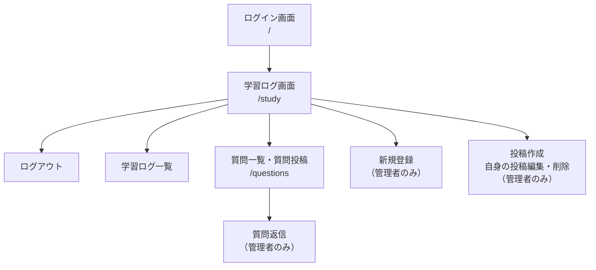

# 学習記録アプリ

## サービス概要

プログラミング学習者向けの学習記録SNSです。

独学では、学習内容を振り返りづらい、モチベーション維持が難しい、気軽に質問できる場所が少ないといった課題があります。

そこで、自分自身の学習記録を継続しながら、質問やリアクションを通じて学習を続けやすくするサービスとして開発しています。

## URL

デプロイ後に記載予定です。

https://xxxxx.example.com
テストアカウント
デプロイ後に記載予定です。

Email: test@example.com
Password: ********

##　ターゲット

プログラミングを独学している方
未経験からエンジニアを目指している方
学習記録を継続したい方
機能一覧
機能	内容
認証機能	Supabase Authによるログイン・新規登録
学習ログ投稿	学習内容の投稿・編集・削除
いいね機能	投稿へのリアクション
質問投稿機能	学習中の疑問を投稿
質問返信機能	質問に対する返信
権限制御	Supabase RLSによるアクセス制御
権限制御

##　画面一覧

##　画面遷移図

学習ログの作成・編集・削除は、RLSにより許可されたユーザーのみ実行可能
いいねはログインユーザー本人の user_id で作成・削除
質問はログインユーザーが投稿可能
質問への返信は管理者のみ投稿可能
RLSポリシーはSupabase側で管理しており、今後はSQLファイルとしてリポジトリ管理する予定です。

##　使用技術
フロントエンド
Next.js App Router
React
TypeScript
Tailwind CSS
バックエンド
Next.js Route Handlers
Supabase Client
データベース
Supabase PostgreSQL
認証・認可
Supabase Auth
Supabase Row Level Security
デプロイ
Render
Supabase
データベース設計
主なテーブルは以下です。

テーブル	役割
users	アプリ内で使用するユーザー情報
posts	学習ログ投稿
likes	投稿へのいいね
questions	質問投稿
question_replies	質問への返信
##　ER図
準備中です。

##　画面遷移図
準備中です。

##　認証・認可設計
一般ユーザー
├─ ログインログアウト
├─ 記事の閲覧
├─ 質問作成
└─ いいね

管理者
├─ログインログアウト
├─記事の作成・閲覧・編集・削除
├─ 質問への回答
└─ 新規アカウントの作成

##　RLS（Row Level Security）設計

本アプリでは Supabase の RLS を利用し、データベースレベルでアクセス制御を実施している。

posts
操作	権限
SELECT	全ユーザー
INSERT	管理者のみ
UPDATE	投稿者本人のみ
DELETE	投稿者本人のみ
likes
操作	権限
SELECT	全ユーザー
INSERT	ログインユーザー本人のみ
DELETE	作成者本人のみ
questions
操作	権限
SELECT	質問作成者本人または管理者
INSERT	ログインユーザー本人のみ
question_replies
操作	権限
SELECT	全ユーザー
INSERT	管理者のみ
users
操作	権限
SELECT	自分のユーザー情報のみ

## 改善予定
 RLSポリシーをSQLファイルとしてリポジトリ管理する
 検索機能
 タグ機能
 画像アップロード機能
 通知機能
 ページネーション
 テストコード追加
 CI/CD設定
開発背景
私は現在、独学でWeb開発を学習しています。

学習を継続する中で、学習内容を後から振り返りにくいことや、質問内容を整理する場所が欲しいと感じました。

そこで、自分自身が使いたいサービスとして、学習記録と質問をまとめて管理できるSNS型アプリを開発しています。

今後も機能追加や設計改善を継続していく予定
です。